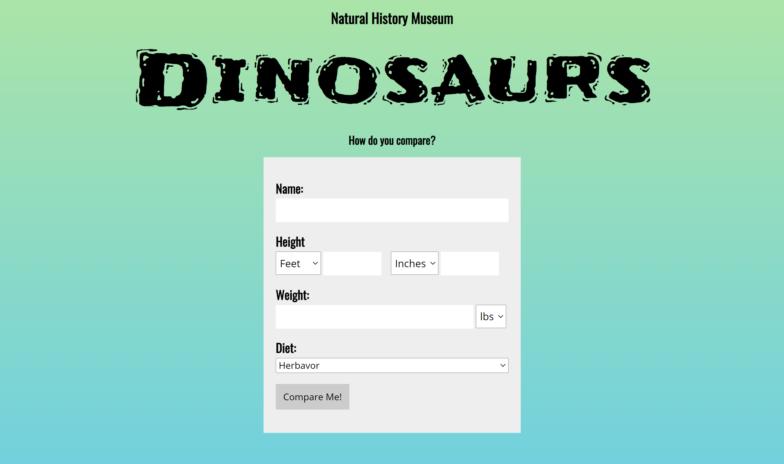
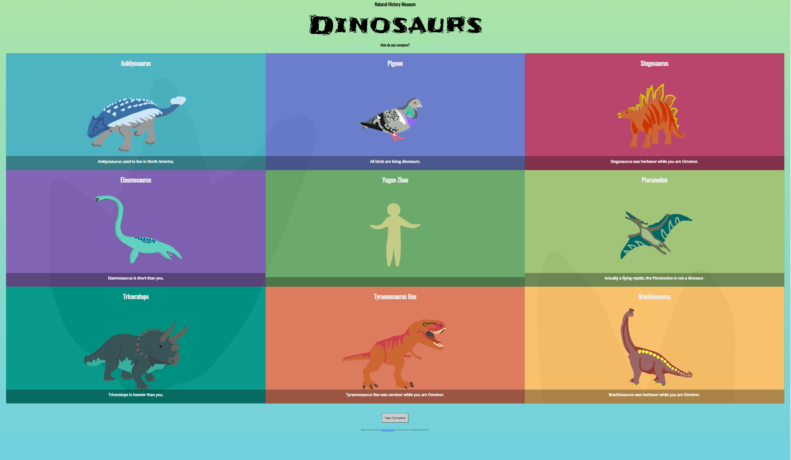

# Object Oriented JavaScript


### Big Picture

I build an infographic that is derived from data that is provided, as well as user input data. Object-oriented JavaScript is great for working with complex data, but it’s not of much use without an interface to interact with. You will be pulling in information from a form and using it to complete an array of objects that will then be appended back to the DOM.


For the project, I generate a 3x3 grid of tiles (9 in total) with the human in the center tile. Each title will contain the species, an image, and a fact. For the human tile, it displays the name of the human rather than species and no fact is necessary for the human. When the user clicks to generate the infographic from the form, the grid will appear and the form will be hidden. The facts displayed are random per dinosaur with an opportunity of displaying at least 6 different types of facts (3 are from the methods I created). One of the titles is for a pigeon in which the tile is always displayed, “All birds are considered dinosaurs.”


### Getting Started

Please follow these steps to get started:

1. We'll start with the typical setup - clone this repo and install the dependencies

```git clone https://github.com/cheerworld/DinosProject.git```

2. We get human data from the form, you need to enter name, height, weight, diet to be able to compare. If you don't fill out all the information required, the form won't let you see the compare page. You have the flexibility to change the height from feet to m, inches to cm, and change weight from lbs to kg.


3. After you click the button to compare, you will see comparing facts about you and the dinosaurs. If you hover on each dinosaur, you will see all the facts about that dinosaur. I am including a comparison image below.


4. You can do a New Compare by clicking the button at the end of the page!

### Project facts

In this project, my UI shows the following:

- [ ] The form contains a button which upon clicking, removes the form
- [ ] The button appends a grid with 9 tiles to the DOM with the Human located in the center
- [ ] The Human tile displays the name of the person and an image, the dino tiles contain the species, an image, and a fact, the bird title should contain the species, image, and "All birds are Dinosaurs."
- [ ] When hover, show all facts about the dinosaur.
- [ ] "New Compare" button to click to do a new compare.


In this project, my backend code:

- [ ] Contain a class and all necessary objects
- [ ] Contain at least 3 methods for comparing dinosaurs to the human
- [ ] Get user data from the DOM
- [ ] Append tiles with object data to DOM

### Above and Beyond

1. I validate the form data to ensure the data is acceptable and complete.
2. Allow the user to generate a new infographic.
3. Move the tile colors from CSS to JS for more control.
4. Randomize the order of the tiles while keeping the human in the middle.
5. Create a hover state on the tiles that display the rest of the species statistics.


Have fun and enjoy the Dinosaurs Compare Project!
